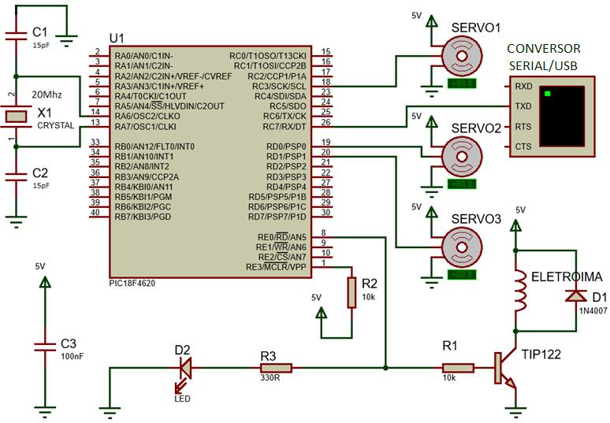
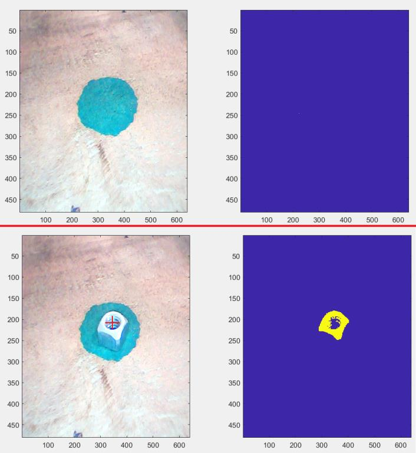

# braco-robo-visao-computacional
> Projeto de firmware de sistema envolvendo manipulador robótico para a separação de porcas, parafusos e arruelas, com base em imagens recebidas por webcam.

## Demonstração

## Funcionamento

Uma câmera realiza aquisição de video sobre uma região dentro do alcance do manipulador robótico, as imagens são enviadas para um computador para serem processadas, produzindo um comando enviado a um conversor USB serial, seguindo para um microcontrolador PIC, que controla o braço robótico de acordo com o comando recebido na porta serial. 

## Hardware

## Detecção e classificação de imagens

O classificador de imagens foi treinado a partir de um banco de dados contendo 500 fotos de parafusos, 500 de arruelas e 500 de porcas, que foi particionado em 90% para treinamento e 10% para testes de maneira aleatória e a partir das características extraídas das imagens, primeiramente foi criado um vocabulário de 1000 palavras visuais com a classe `BagOfFeatures` da Computer Vision Toolbox e em seguida, essas características extraídas da imagem foram passadas a função `rainImageCategoryClassifier`, para gerar o classificador treinado, esse classificador é baseado em SVM.

# Meta

Igor Goulart de Almeida - [Linkedin](https://www.linkedin.com/in/igor-goulart-de-almeida-33a96711a/)
MIT licence
<https://github.com.br/seuusuario/seuprojeto>

